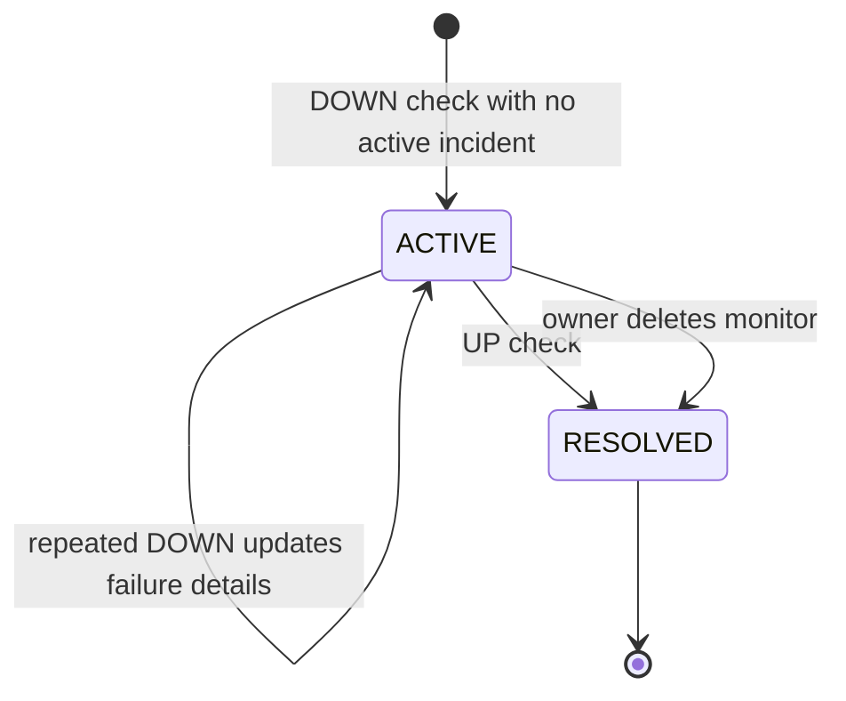

# DeployBoard

DeployBoard is a multi-user, cloud-native uptime monitoring dashboard for websites and APIs. It runs scheduled HTTP checks, records response history, manages incidents, and presents service health through a modern dark interface.

The project is deployed on AWS EC2 with k3s and DynamoDB. Docker images are built and published through GitHub Actions, then rolled out through Kubernetes using Traefik ingress.

> **Production milestone:** the multi-user release is live in `eu-north-1`, with authenticated and user-isolated monitors, checks, and incidents.

## Feature overview

| Area | What DeployBoard provides |
| --- | --- |
| Authentication | Username/password registration, login, persisted JWT sessions, and logout |
| Monitoring | Monitor CRUD, configurable intervals, manual checks, and background checks |
| Health data | HTTP status, response time, check history, and `UP`/`DOWN` state transitions |
| Incidents | Automatic creation, deduplication, recovery resolution, and incident history |
| Dashboard | Summary statistics, monitor health table, and selectable response-time charts |
| Operations | Docker, GHCR, Kubernetes, Traefik, DynamoDB, and GitHub Actions deployment |

## Screenshots

Screenshots are not committed yet. Future captures will be stored in `assets/screenshots/`; until then, these text placeholders intentionally avoid broken image links.

| View | TODO |
| --- | --- |
| Auth screen | _TODO: add the login and registration screen_ |
| Dashboard | _TODO: add the monitoring overview and response chart_ |
| Monitors | _TODO: add the monitor management table and form_ |
| Incidents | _TODO: add active and resolved incident history_ |
| Status Pages | _TODO: add the planned status-page preview_ |

## Tech stack

| Layer | Technology |
| --- | --- |
| Backend | FastAPI, Pydantic, httpx |
| Authentication | JWT, pwdlib, Argon2 |
| Frontend | React, Vite, Tailwind CSS |
| Visualization | Recharts |
| UI icons | lucide-react |
| Persistence | Amazon DynamoDB |
| Containers | Docker, Nginx |
| Registry | GitHub Container Registry |
| Orchestration | k3s on AWS EC2 |
| Ingress | Traefik |
| CI/CD | GitHub Actions |
| Tests | pytest, Vitest, React Testing Library |

## Architecture

```mermaid
flowchart TD
    User[User browser]

    subgraph AWS["AWS · eu-north-1"]
        subgraph EC2["EC2 · single-node k3s"]
            Ingress[Traefik ingress]
            Frontend[React frontend<br/>Nginx container]
            Backend[FastAPI backend<br/>scheduler and API]
        end
        DynamoDB[(DynamoDB v2 tables)]
        IAM[EC2 IAM role]
    end

    Targets[Monitored websites and APIs]
    Actions[GitHub Actions]
    GHCR[GitHub Container Registry]

    User -->|HTTP| Ingress
    Ingress -->|/| Frontend
    Ingress -->|/api and /health| Backend
    Backend -->|checks with httpx| Targets
    Backend -->|users, monitors, checks, incidents| DynamoDB
    IAM -. authorizes .-> DynamoDB
    Actions -->|build and push| GHCR
    GHCR -->|latest images| EC2
    Actions -->|SSH deploy and rollout| EC2
```



The frontend uses same-origin API paths in production. Traefik routes `/` to the frontend service and `/api` plus `/health` to the backend service.

## Key features

- Register, log in, restore an authenticated session, and log out.
- Create, edit, delete, and manually check website or API monitors.
- Configure expected HTTP status and check interval per monitor.
- Run automatic checks in the backend scheduler.
- Track response times, status codes, failures, and expiring check history.
- Represent monitor health as `UP`, `DOWN`, `DEGRADED`, or `UNKNOWN`.
- Enforce a configurable maximum number of monitors per user.
- Show an overview dashboard with global statistics and latest monitor health.
- Select a monitor independently for its response-time chart.
- Review active and resolved incidents on a dedicated incidents page.
- Preview the planned public Status Pages experience.

## Multi-user authentication and data isolation

DeployBoard uses usernames and passwords; email is not part of the authentication model.

- Usernames are unique and validated before registration.
- Passwords are hashed with Argon2 through `pwdlib` and are never stored as plain text.
- Login issues a signed JWT access token.
- Protected monitor, check, and incident endpoints derive ownership from the authenticated user.
- Monitor and incident queries are partitioned by `user_id` in DynamoDB.
- Check-history responses are also validated against the monitor owner.
- Cross-user monitor operations return `404` to avoid disclosing resource existence.

Local development defaults to in-memory repositories. Production selects DynamoDB through environment configuration.

## Incident lifecycle



Only one active incident is kept for a monitor at a time. Repeated failures update the current incident rather than creating duplicates, while recovery preserves the resolved incident as history.

## DynamoDB data model

Production uses the multi-user v2 tables; the old single-user tables were removed after migration.

| Table | Partition key | Sort key | Important fields and behavior |
| --- | --- | --- | --- |
| `deployboard-users` | `username` | — | `id`, `password_hash`, `created_at`; conditional writes enforce uniqueness |
| `deployboard-monitors-v2` | `user_id` | `id` | URL, expected status, interval, and current monitor state |
| `deployboard-checks-v2` | `monitor_id` | `checked_at` | `user_id`, response data, and `expires_at` TTL attribute |
| `deployboard-incidents-v2` | `user_id` | `started_at` | Monitor snapshot, status, failure details, and resolution timestamp |

`expires_at` is an integer Unix epoch timestamp derived from `checked_at` and `CHECK_HISTORY_TTL_DAYS`. DynamoDB TTL is enabled on that attribute to expire old check history automatically.

Active incidents are currently selected within one user's incident partition. If incident volume grows substantially, a status-oriented secondary index would make that access pattern more selective.

## CI/CD and deployment flow

The workflow runs on pushes to `main` and can also be started manually:

1. GitHub Actions checks out the repository and authenticates to GHCR with a GitHub secret.
2. Backend and frontend Docker images are built with both `latest` and commit-SHA tags.
3. Both tags are pushed to GitHub Container Registry.
4. The deploy job connects to the EC2 node over SSH using GitHub secrets.
5. The node updates its repository checkout and applies the manifests in `k8s/`.
6. Both deployments are restarted and their rollout status is checked.

Current images:

```text
ghcr.io/kaan-yassibas/deployboard-backend:latest
ghcr.io/kaan-yassibas/deployboard-frontend:latest
```

## Local development

### Prerequisites

- Python 3.12+
- Node.js 22+
- npm

AWS credentials are not required when using the default in-memory storage.

### Backend

```bash
cd backend
python -m venv .venv
pip install -r requirements.txt
uvicorn app.main:app --reload
```

Activate the virtual environment before installing dependencies if your shell does not automatically use it. The API exposes interactive documentation at `/docs` and a public health endpoint at `/health`.

### Frontend

```bash
cd frontend
npm install
npm run dev
```

When Vite and FastAPI run on different origins locally, set `VITE_API_BASE_URL` in an ignored local environment file to the backend origin. In production this variable is omitted, so the frontend uses the same-origin `/api` fallback through Traefik.

## Environment variables

Only variable names are documented here. Never commit production values or secrets.

| Variable | Purpose |
| --- | --- |
| `ENVIRONMENT` | Selects the application environment |
| `STORAGE_BACKEND` | Selects the repository storage implementation |
| `AWS_REGION` | Selects the AWS region for DynamoDB clients |
| `DYNAMODB_USERS_TABLE` | Configures the users table |
| `DYNAMODB_MONITORS_TABLE` | Configures the monitors table |
| `DYNAMODB_CHECKS_TABLE` | Configures the checks table |
| `DYNAMODB_INCIDENTS_TABLE` | Configures the incidents table |
| `JWT_SECRET_KEY` | Signs and validates access tokens |
| `JWT_ALGORITHM` | Configures the JWT signing algorithm |
| `JWT_EXPIRE_MINUTES` | Configures access-token lifetime |
| `MAX_MONITORS_PER_USER` | Sets the per-user monitor limit |
| `CHECK_HISTORY_TTL_DAYS` | Sets check-history retention before TTL expiry |
| `VITE_API_BASE_URL` | Optionally overrides the frontend API origin for local development |

Production requires `JWT_SECRET_KEY` to be injected from the Kubernetes Secret; it is not stored in the repository.

## Testing

Backend tests use memory storage and FastAPI's test client:

```bash
cd backend
pytest
```

Frontend tests mock network requests and never call a real backend:

```bash
cd frontend
npm run test
npm run lint
npm run build
```

Current test-hardening milestone:

- Backend: 23 pytest tests covering authentication, validation, isolation, monitor limits, TTL, and incident lifecycle.
- Frontend: 13 Vitest tests covering authentication, session handling, navigation, dashboard actions, Status Pages guidance, and response statistics.

## Production deployment notes

- Region: `eu-north-1`.
- Runtime: a single-node k3s cluster in the `deployboard` namespace on AWS EC2.
- The node uses an EC2 IAM role for DynamoDB access; static AWS keys are not required by the application.
- `t3.small` was selected after the initial smaller instance experienced memory pressure while running k3s.
- The single-node design is cost-conscious and suitable for a portfolio deployment, but it is not highly available.
- The design avoids a managed Kubernetes control plane, external load balancer, and NAT Gateway; EC2, EBS, public IPv4, data transfer, and DynamoDB usage should still be monitored.
- The current ingress maps `/`, `/api`, and `/health`; custom-domain and HTTPS hardening remain future work.

Useful operational checks:

```bash
kubectl get pods -n deployboard
kubectl get svc -n deployboard
kubectl get ingress -n deployboard
kubectl rollout status deployment/deployboard-backend -n deployboard
kubectl rollout status deployment/deployboard-frontend -n deployboard
curl http://localhost/health
```

## Security notes

- Password hashes use Argon2; plain-text passwords are never persisted.
- JWT signing configuration is injected at runtime through a Kubernetes Secret.
- DynamoDB access uses the EC2 IAM role and the standard AWS credential chain.
- CI/CD credentials, SSH material, and host details are stored in GitHub secrets.
- API ownership checks scope user data by `user_id` and avoid cross-user resource disclosure.
- Check history is retained only for its configured TTL period.
- Environment files, private keys, kubeconfig files, and local credentials are ignored by Git.
- HTTPS should be enabled before treating the portfolio deployment as a production-grade public service.

## Roadmap

- Public status page publishing
- Notifications for downtime and recovery
- Custom headers for authenticated or specialized checks
- Better uptime and response-time analytics
- Team and workspace support
- Custom domain and HTTPS automation

## Why this project matters

DeployBoard is deliberately more than a local CRUD demo. It connects application development with the operational work required to run a real service:

- designing authenticated, user-isolated APIs;
- modeling access patterns and TTL retention in DynamoDB;
- measuring availability and maintaining an incident lifecycle;
- containerizing React and FastAPI services;
- operating Kubernetes workloads and ingress on AWS;
- publishing images and automating rollouts through CI/CD;
- applying cloud security, IAM, secret management, and cost-awareness practices; and
- hardening the system with backend and frontend tests.

It serves as a practical portfolio project across DevOps, AWS, Docker, Kubernetes, CI/CD, monitoring, DynamoDB, and multi-user application security.
